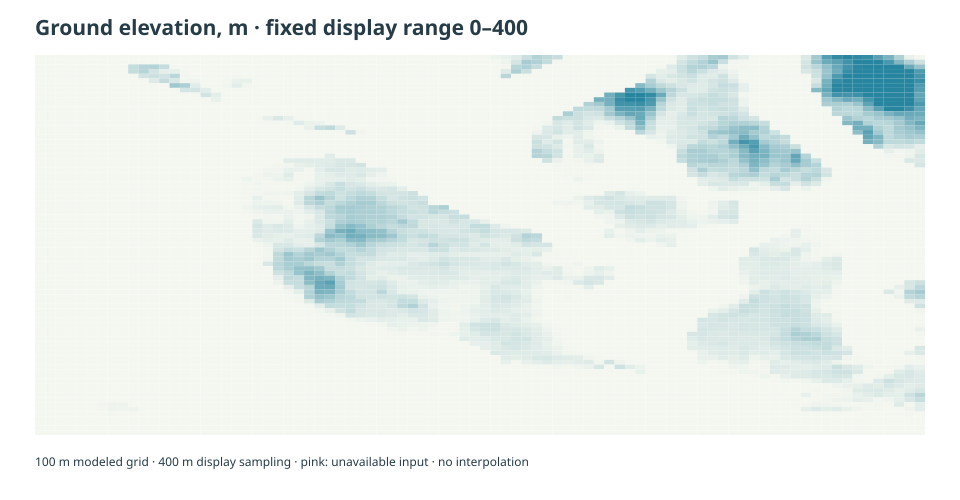
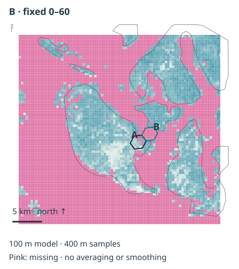

# Examples: understand what can be seen

Follow a real San Juan Islands example from map inputs to modeled viewing support. No coding required.

**Worked example A → B.** Start with **Observer area A** and **Water area B**, already selected on the real map below.
These are modeled areas in the central San Juan Islands. Follow the seven questions in order,
then explore other areas. No coordinates or map identifiers are needed.

Real-data example · {{analysis_resolution}} m model · {{canopy_year}} tree heights · {{missing_canopy}} of mapped land pixels lack tree-height data in the buffered input grid. Missing heights use a zero-height fallback. This fraction is about inputs, not affected pairs. Scores describe modeled viewing support, not sighting probability.

<section class="lesson" id="lesson-inputs" markdown="1">

## 1. What are we starting with?

The source is the area an observer could look from; the target is the water area we are asking
about. Hexagons give the model consistent map areas. They are not exact observer positions.
Ground elevation measures how high the land is. Tree height measures vegetation above that
ground. Adding them creates an obstruction surface. The real coastline separates land and water.
**Try it:** switch between land/water boundaries, ground elevation and tree heights. All use the same projected map and scale. Open the input previews to compare these layers. Pink pixels have no recorded height; they are
not evidence of bare ground. Sightings do not enter this calculation.

<figure>{{figure_inputs}}<figcaption>Actual source samples and real mapped areas. A source area is not a guaranteed public lookout.</figcaption></figure>

Reveal ground elevation

{ loading=lazy }

USGS elevation was acquired at {{dem_native}} m and prepared at {{analysis_resolution}} m. The preview samples every fourth pixel.

Reveal tree height and missing data

{ loading=lazy }

ETH {{canopy_year}} canopy was acquired at {{canopy_native}} m and resampled by maximum height to the {{analysis_resolution}} m model grid.
The preview shows {{display_resolution}} m display sampling; it does not add detail to the model.

Real mapped inputs and modeling assumptions determine the result; sightings are not an input.

Technical details: inputs and support

Ground and canopy share a projected {{analysis_crs}} analysis grid. Land/water boundaries use generalized
Natural Earth 1:10m land. Missing ground is an opaque barrier; missing canopy has zero obstruction.
The [bundle manifest](assets/examples/san-juan/manifest.json) records source checksums, licenses,
resolution, observer/target heights, curvature and the full configuration assumptions.

</section>

<section class="lesson" id="lesson-samples" markdown="1">

## 2. How does the model look from an area?

The dots inside Observer area A are the positions actually sampled by the model. It compares
those positions with water support inside the target area and averages the modeled results.
**Try it:** follow the highlighted source sample and target endpoint on the map and the matching profile: the ground, the ground plus trees,
and a straight viewing ray adjusted for the configured curvature assumption. That single path
helps explain the geometry. **One explanatory sampled path; the area result summarizes the modeled population. This is not an engine trace or every contributing path.** The area summary includes other
positions and water pixels, so an open or blocked profile alone cannot establish its aggregate.

**Actual result — Worked example A → B:** unweighted ground support is {{line_of_sight_support}}.

<figure>{{figure_samples}}<figcaption>Worked example A → B: actual modeled observer samples and the linked explanatory profile. The axes use physical units with vertical exaggeration.</figcaption></figure>

The cell summarizes multiple modeled positions, not the view from one guaranteed public lookout.

Reveal the area result and sampling details

{{table_samples}}

Land observers use {{sample_min}}–{{sample_max}} deterministic samples per active land area. Water support uses raster
water pixels with a geometric water-area denominator. Water-source calculations use a separate
sample design and opaque-land mask. Profiles sample the real prepared ground and the production
observer-specific canopy surface at up to {{profile_step}} m intervals; the underlying model is {{analysis_resolution}} m. These are
explanatory profiles, not GDAL engine diagnostics. Observer clearance is {{clearance}} m in this example.

</section>

<section class="lesson" id="lesson-distance" markdown="1">

## 3. What changes as water gets farther away?

This model assigns less support as distance increases. **Try it:** select Nearer water, then Farther water. Compare the selected near and far water
areas with the curve below. The markers show their actual centroid distances and diagnostic
values. {{distance_population}} and have strong bare-ground support, but their final scores
are not a controlled comparison of distance alone. The curve is an assumed attenuation rule,
not a calibrated sighting probability. During the full calculation it is applied to each
observer-to-water distance, rather than just these centroid distances. Reveal the values to
compare the two real examples.

**Actual result:** {{distance_reading}}

<figure>{{figure_distance}}<figcaption>The configured distance curve, evaluated by the production function, with actual pair-distance markers.</figcaption></figure>

The distance diagnostic explains the model; it is not multiplied into the final result twice.

Reveal near/far results and attenuation assumptions

{{table_distance}}

{{distance_rule}}

</section>

<section class="lesson" id="lesson-terrain" markdown="1">

## 4. Why can nearby water still be hidden?

Distance is only one part of the answer. **Try it:** select Open ground, then Ground-blocked example. Compare the real examples below using ground-only line
of sight, which measures geometric support before attenuation. One pair has open bare-ground
support; the other has zero bare-ground support. Its sampled real topographic profile crosses
the viewing ray, illustrating an intervening obstruction. The profile represents one path and
is not an engine trace for every sample. Reveal the values to separate this evidence from a
small distance-weighted score. A low integrated score by itself would not establish that a
ridge blocked the view.

**Actual result:** {{terrain_reading}}

<figure>{{figure_terrain}}<figcaption>Unweighted bare-ground LOS with explanatory real profiles. The zero-support profile illustrates a ground obstruction.</figcaption></figure>

Nearby water does not guarantee an open modeled line of sight.

Reveal ground-only values and profile limits

{{table_terrain}}

Ground-only support is the matched-population mean of bare line of sight, `J_bare`.
Profiles preserve elevations, physical units, endpoints and curvature assumptions. No values
were edited to produce the contrast. The curated cases are teaching examples, not regional statistics.

</section>

<section class="lesson" id="lesson-canopy" markdown="1">

## 5. What do trees change?

**Worked example A → B.** Keep the same observer area, water area and sampling population.
**Try it:** compare Ground only with Ground + tree heights, then select Little canopy effect.
Ignoring canopy is a model comparison; it is not an observation of a treeless landscape.

**Actual result:** {{canopy_reading}}

Reveal the technical comparison for the separate distance-weighted retention factor. Missing canopy uses zero height, and the modeled observer has a
{{clearance}} m clearance assumption; both can influence the contrast.

<figure>{{figure_canopy}}<figcaption>Matched bare/canopy populations with directly calculated unweighted support. The vegetation ratio is distance weighted.</figcaption></figure>

Trees can remove support that ground alone allows; a neutral factor is not proof of clear vegetation.

Reveal the comparison and canopy states

{{table_canopy}}

For the fixed worked example A → B, retained integrated support is {{vegetation_attenuation}}. Distance weights individual paths; this factor is different from the unweighted indices.

When the bare integrated kernel is zero, the stored neutral factor is bookkeeping: **no baseline
support; canopy factor is not interpretable**. For water-source roles canopy is **not applicable**.
Unweighted canopy support is calculated directly. It is not bare support multiplied by the
conditional weighted ratio. Maximum resampling, clearance and the missing-height policy are
explicit assumptions, not field observations.

</section>

<section class="lesson" id="lesson-combined" markdown="1">

## 6. Put the pieces together: what can this area see?

**Worked example A → B.** **Try it:** select Worked support, then Modeled zero. Return to Observer area A. Each colored target summarizes its modeled support on a fixed 0–1
scale. The selected pair has ground-plus-distance support **{{distance_weighted_los_support}}**,
retained support after vegetation **{{vegetation_attenuation}}**, and combined modeled support
**{{distance_adjusted_viewability}}**. Pale cells are computed zeros. Areas without a candidate
record are not assigned zero. Reveal the positive and zero examples to compare actual values.
The result describes physical viewing support under the recorded assumptions. It does not say
an observer is present, that an animal is there, or that a sighting will occur.

<figure>{{figure_combined}}<figcaption>Fixed 0–1 combined support for the selected source. Pale gray: modeled zero; uncolored: no candidate result.</figcaption></figure>

This is modeled viewing support, not a prediction that an animal or observer is present.

Reveal results and the combination rule

{{table_combined}}

`W = K_bare × min(K_canopy, K_bare) / K_bare` for positive baseline support.
When `K_bare = 0`, the neutral vegetation factor leaves `W = 0`.
The separate centroid diagnostic is not another multiplier. Raw canopy-over-bare discrepancies
are retained in the scientific artifacts; the cap policy prevents increasing combined support.

</section>

<section class="lesson" id="lesson-inverse" markdown="1">

## 7. Which observer areas could see this water area?

**Worked example A → B.** **Try it:** switch the Question control between forward and inverse; A → B retains the same result. The earlier question fixed an observer area and asked about water around it. Now fix Water area B
and ask which included observer areas have modeled support for that water. The map shows the
same pair records from the other direction. A → B still has combined support
**{{distance_adjusted_viewability}}**; no reversed model run changes its value. Reveal the
contributors to compare several included source areas. Counts refer to modeled areas, not
people or boats. Other viewpoints may exist beyond this example, and a coastal hexagon can
support distinct land and water source roles.

<figure>{{figure_inverse}}<figcaption>Sources included in this example. The selected pair keeps exactly the same value in either query direction.</figcaption></figure>

This is another way to read the same results, not a reversed run or all possible viewpoints.

Reveal contributing pairs and role identity

{{table_inverse}}

Pair identity includes the source role. The selected land source is `{{source}}` and target is
`{{target}}`. Forward and inverse indexes point to identical canonical records. A mixed cell's
land and water computations use different observer and obstruction assumptions.

</section>

## Explore other areas

The linked explorer follows below. The seven figures and reveal tables remain useful with
JavaScript disabled and when third-party services are unavailable.

## Practical assumptions

This is a coarse, bounded example: {{analysis_resolution}} m terrain, generalized shoreline, sampled positions and
{{cutoff}} km candidates. Tree heights represent {{canopy_year}}. Missing heights are a fallback, not observed
absence of trees. Land samples do not establish public access. Water roles use an opaque-land
model and separate sampling. Results are static physical support, separate from detection,
effort, animal presence and sightings. Sampling, resolution and clearance sensitivity has not
yet been run; empirical field accuracy is not established.

## Run this yourself

Reproduce or inspect the real-data example

The [reproduction guide](documentation-examples.md) separates bounded real model execution,
scientific export and offline checks. It lists source rights and validation limits.
The [scientific methodology](scientific-methodology.md) defines populations and denominators.

Scientific generation: `{{generation}}`.

Sources: [USGS 3DEP](https://www.usgs.gov/3d-elevation-program),
[ETH {{canopy_year}} canopy, Lang et al.](https://langnico.github.io/globalcanopyheight/)
([CC BY 4.0](https://creativecommons.org/licenses/by/4.0/)), and
[Natural Earth](https://www.naturalearthdata.com/about/terms-of-use/) (public domain).
Clipping, resampling and modeled LOS create these derived examples; raw datasets are not included.

