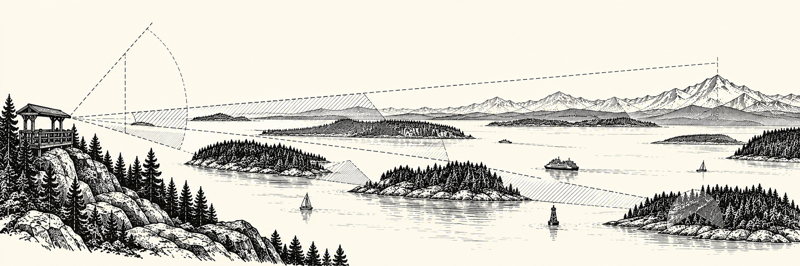

# Viewshed Toolkit

Map the <strong>physical limits of a view</strong> from coastal land and open water.

An observation needs a line of sight. Terrain, trees and distance can constrain that view before
anyone arrives. Viewshed Toolkit makes those constraints inspectable: it turns mapped inputs and
explicit assumptions into reproducible source-to-water viewing support.

For researchers and applications, this provides a physical layer to consider alongside separately
measured observer activity or sightings. A quiet patch of water and a hidden patch of water are
different questions; this toolkit addresses the geometry of the view.

[Read the visual walkthrough](examples.md){ .md-button .md-button--primary }
[Install and run](getting-started/quick-start.md){ .md-button }

!!! important "What a result means"
    These are **static physical viewability** products. A score is not the probability of seeing
    an animal, a measure of observer effort, evidence of public access, or a forecast. Mapped input
    coverage and model assumptions travel with the result.

## Find your starting point

-   **See the model in action**

    Read three connected chapters: one pair, one source’s surrounding targets, then a summary for each target cell.
    No coding or downloads needed.

    [Open the guided example](examples.md)

-   **Run a first workflow**

    Set up the native geospatial environment, inspect a configuration, and choose a bounded run.

    [Installation](getting-started/installation.md) · [Quick start](getting-started/quick-start.md)

-   **Understand the calculation**

    Learn what a source area means, how land and water differ, and how trees and distance enter.

    [Viewing concepts](understand/index.md) · [Scientific contracts](scientific-methodology.md)

-   **Use the outputs**

    Choose pair-level viewability, observation geometry, or reusable distance products for your task.

    [Product guide](products/index.md) · [API overview](api/overview.md)

## From mapped inputs to viewing support

| Start with | Inspect | Use |
| --- | --- | --- |
| Ground elevation, canopy height and land/water boundaries | Matched ground and canopy line of sight for land sources; opaque-land geometry for water sources | Static source-to-water pair weights |
| Source areas, target water and deterministic sample positions | Unweighted LOS, distance-integrated support and coverage states | Observation-geometry diagnostics |
| A validated source–target lookup | Centroid distances and named attenuation curves | Independent distance products |

Each result retains its source role and pair identity. Component values help explain the output;
missing data and modeling assumptions remain visible. [Choose a product](products/index.md) or
[trace the method](methodology.md).

## A small place to learn: the San Juan Islands

The guided example lets you compare real ground elevation, mapped tree heights and coastal
geometry in finished figures. Follow one source and water target through a sampled profile,
three coverage maps, and the strongest included land-source support for each target.

The committed bundle can be read without GDAL. It is a bounded real-data illustration with recorded
coverage gaps and assumptions; it is not field validation or a full Salish Sea release.

[Read the three chapters](examples.md){ .md-button }
[Choose a workflow](workflows/index.md) · [Reproduce the bundle](documentation-examples.md)
