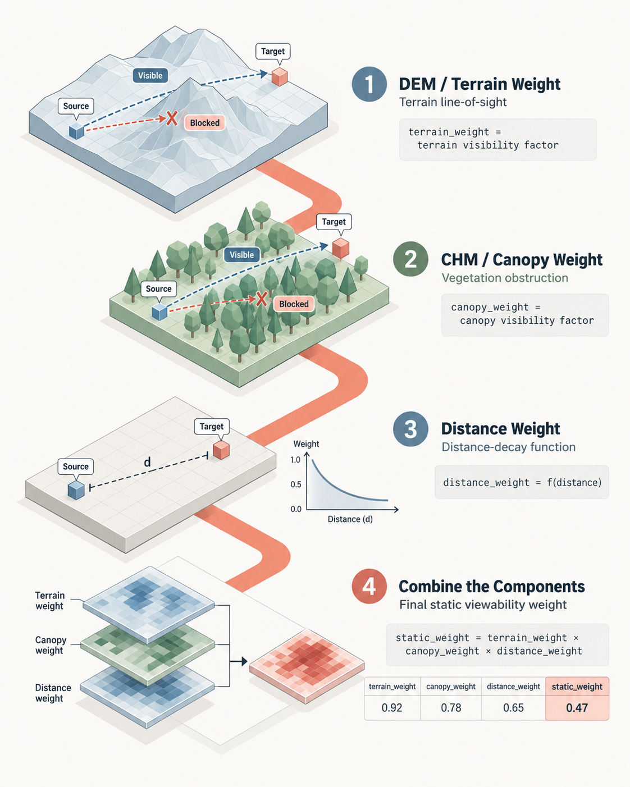
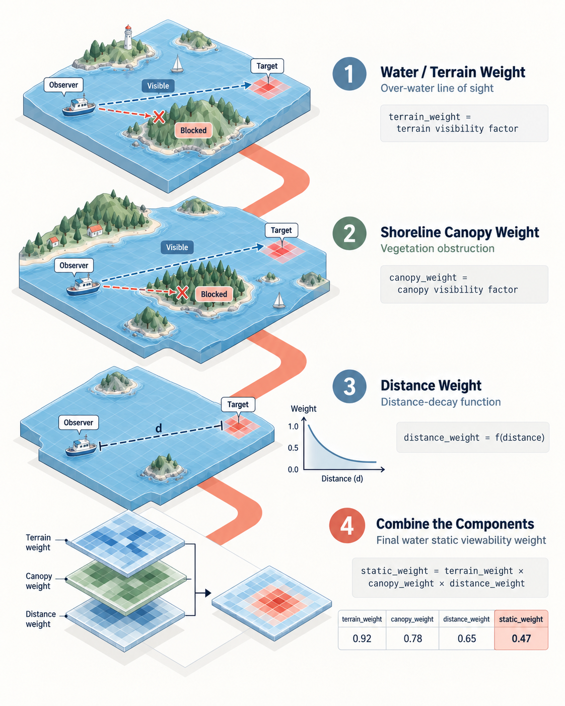
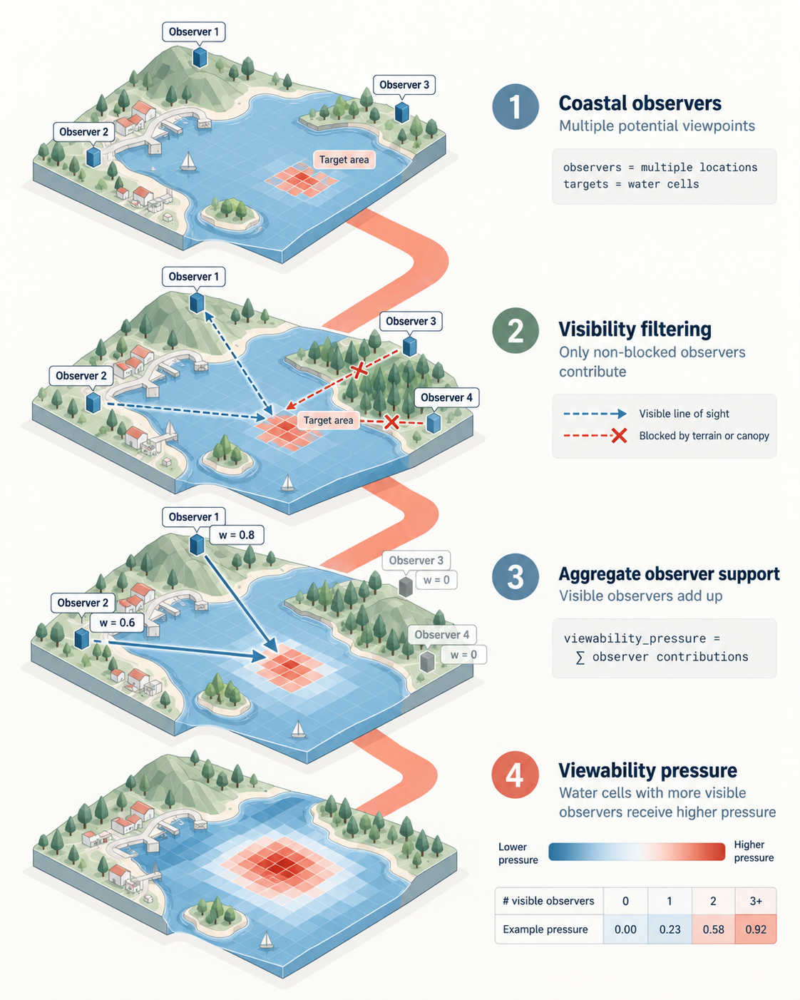

# Methodology

The pipeline models physical viewing support between an active source area and a target area.
Both sides use durable H3 identifiers, and the final table grain is one unique
`source_h3 × target_h3` pair.

The graphic is a conceptual overview. Whale icons identify an illustrative target area; animal
activity is not an input to the static viewability model.

For reproduction or review, use the [scientific methodology](scientific-methodology.md) as the
complete numerical reference. It defines the sampling design, observer and target averaging
populations, denominators, distance curves, curvature, endpoint repair, raster-gap policies,
sparse-result semantics, and canopy clearance, with links to their implementation owners and
regression tests. This page intentionally stays at the workflow level.

The staged calculation is:

1. Build valid land and water source/target support and candidate pairs.
2. Sample observer points inside active source geometry.
3. Calculate clear-sky line of sight against a projected terrain surface, including configured
   observer and target heights, range, curvature, and nodata policy.
4. Calculate the distance diagnostic/kernel and conditional canopy attenuation.
5. Compose the configured factors on the canonical pair universe with explicit missingness and
   uniqueness checks.
6. Materialize compact H3 pair kernels and optional selected-source or aggregate maps.

## Component views

The land and water diagrams below illustrate the roles of terrain, canopy, and distance in the
workflow. Their displayed three-factor multiplication is deliberately simplified: it is **not**
the literal formula used by the current implementation. The terrain kernel already integrates
observer-to-pixel distance attenuation, so the separately persisted H3-centroid distance weight is
inspectable but is not multiplied into the final static weight again. The exact equations are in
the [scientific methodology](scientific-methodology.md).

### Land sources

Land processing compares matched bare-earth DEM and DEM+CHM line-of-sight support. Canopy is a
conditional factor relative to positive terrain support, not an independent visibility surface.

### Water sources

Water processing treats mapped land as opaque and records canopy as not applicable. Trees in the
illustration help communicate shoreline obstruction; they do not imply that water pairs receive a
measured canopy factor.

### Aggregation

Validated pair weights may be summarized by source or target. A target-cell sum is static viewing
support from the modeled source universe—not observed viewpoint use, observer pressure, animal
presence, or detection probability.

The default Salish Sea run uses H3 resolution 7, full-pixel aggregation, a 30 km hard range,
bare-earth terrain plus a matched canopy surface, and deterministic source sampling. Exact
parameters and version names live in [`configs/salish_sea.yaml`](../configs/salish_sea.yaml).

## Interpretation

`weight_static_viewability` is bounded physical support, not a probability that a whale will be
seen or reported. Observer presence, public access, weather, daylight, platform activity,
reporting capture, animal presence, and ecological processes are distinct layers. Unknown or
unavailable support must remain missing or explicitly state-coded; it must not be silently
converted to zero.

Generated artifacts carry configuration/scientific hashes and sidecar metadata. Reuse is valid
only when the relevant source fingerprints, schemas, spatial grids, and configuration agree.
The migrated case-study artifacts satisfy checksum/schema/config-alignment checks, but that does
not establish that this checkout rebuilt them from raw inputs.
