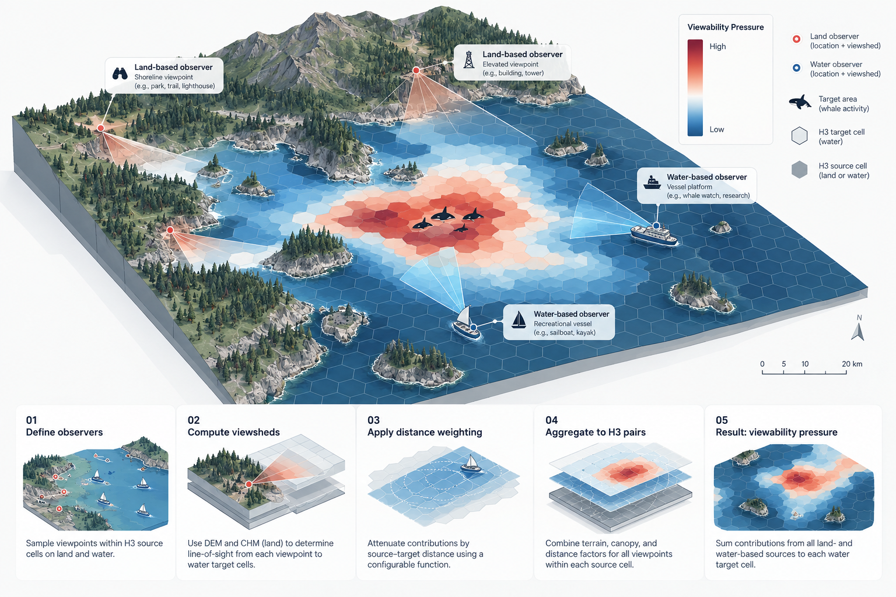

# Salish Sea: Columbia River to northern Vancouver Island

The case study uses `configs/salish_sea_case_study.yaml`, with bounds 128.6°W–121.6°W and
46.0°N–51.1°N. The configured projected 31 km input buffer supports the 30 km visibility radius.
This intentionally extends beyond the separate OrcaCast `model_area` default; the packaged default
and `configs/salish_sea.yaml` remain identical.



This illustration shows the spatial workflow, not a reconstructed case-study result. Target icons
do not add animal activity, observer effort, or detection probability to the model.

## Run from acquisition through analysis

```bash
PYTHONPATH=src python scripts/run_case_study.py --config configs/salish_sea_case_study.yaml
```

For separately managed preparation and computation:

```bash
PYTHONPATH=src python scripts/run_case_study.py --config configs/salish_sea_case_study.yaml --prepare-only
PYTHONPATH=src python scripts/run_case_study.py --config configs/salish_sea_case_study.yaml --compute-only --source-type land
PYTHONPATH=src python scripts/run_case_study.py --config configs/salish_sea_case_study.yaml --compute-only --source-type water
PYTHONPATH=src python scripts/check_case_study_inputs.py --config configs/salish_sea_case_study.yaml
PYTHONPATH=src python scripts/report_case_study.py --config configs/salish_sea_case_study.yaml
viewshed-toolkit validate-region --config configs/salish_sea_case_study.yaml
```

These commands download regional datasets and perform substantial computation. Completed,
validated caches and partitions are reused. Configuration changes invalidate affected products;
do not relabel products from an earlier configuration.

## Configuration-owned directories

```yaml
case_study:
  name: salish_sea
  analysis_root: analysis
  data_root: data
```

`resolve-area` creates `analysis/salish_sea` and `data/salish_sea`. Config loading remains read-only.
Explicit `paths` place all regional source data, prepared rasters, intermediate products, maps,
and numerical results under `data/salish_sea`. The HTML narrative lives in
`analysis/salish_sea/report.html`.

| Location beneath `data/salish_sea` | Contents |
|---|---|
| `raw/land` | Natural Earth archive, shapefile, source attribution |
| `outputs/components/inputs/{dem,chm}` | Acquired assets, checksums, source manifests |
| `prepared` | Aligned 30 m DEM/CHM and buffered water geometry |
| `work` | H3 domains, candidate lookup, raster caches, source partitions |
| `outputs/components/weights/{land,water}` | DEM, CHM, distance, and composed pair tables |
| `outputs/components/final` | Validated final land and water static pair tables |
| `outputs/components/aggregates` | Per-source and per-target summaries for each role |
| `outputs/components/maps` | Terrain, distance, canopy (land), and combined HTML maps |
| `outputs/components/analysis` | Exact input coverage, summary evidence, report artifact |
| `logs` | Acquisition, preparation, execution, and validation logs |

Every canonical component has unique `source_h3 × target_h3` keys. Keep `source_type` in any
cross-role concatenation: mixed coastal H3 cells can participate in both roles.

## Interpretation

Terrain weighting retains the existing observer-to-pixel distance attenuation. Combined support
is terrain × conditional canopy. Centroid distance remains a diagnostic and is not multiplied
again. Water uses the existing opaque-land model and has no applicable canopy factor.

Aggregates report counts, mean, maximum, sum, and positive-support fraction over candidate pairs.
They are unweighted by observer activity. Sums are not probabilities. Conditional canopy means
restricted to positive terrain support are supplied separately from the neutral blocked-pair
factor. Maps use those restricted means for canopy and mark unavailable target summaries gray.
Map colors saturate at the configured display quantile (98% here), with each realized color cap
labeled; this improves regional contrast without changing weights or tooltip values.

Natural Earth is a generalized shoreline. The buffered water complement does not imply public
access, jurisdiction, or observer presence. The ETH product represents 2020 canopy, not current
forest conditions. This configuration retains explicit missing-canopy-as-zero and opaque-DEM-gap
policies. Exact coverage counts accompany the report; missing canopy is never described as
observed treeless land. These outputs do not establish detection probability or whale ecology.

## HTML report packaging

The analysis script writes a canonical, bounded report artifact from the validated full pair
tables. The delivered report is self-contained. To package it with the Data Analytics portable
reader, pass its installed `deliver_portable_artifact.mjs` as `--report-builder` to the full-run
script, or run that builder with the artifact as `--input` and `analysis/salish_sea/report.html`
as `--output`. Report packaging is an optional external authoring tool, not a runtime dependency
of the scientific package. The report generator and raw summaries remain inspectable in the repo.

## Regression fixture

The small Admiralty Inlet CI fixture is synthetic and exercises real GDAL preparation and both
source policies. It checks pair contracts, composition, exact observer sampling equivalence,
larger-batch equivalence, cache behavior, failed downloads, and stale-output rejection. It is not
substituted for the real regional data in this case study.

## Source attribution

Sources accessed September 15, 2026:

- [USGS 3DEP products and services](https://www.usgs.gov/3d-elevation-program/about-3dep-products-services): unrestricted elevation products. The 1 arc-second dataset includes most of Canada; the dynamic service combines available resolutions.
- [ETH Global Canopy Height 2020](https://langnico.github.io/globalcanopyheight/), CC BY 4.0. Lang, N., Jetz, W., Schindler, K., and Wegner, J. D. (2023), *A high-resolution canopy height model of the Earth*, Nature Ecology & Evolution. This is an estimated canopy-height product derived from Sentinel-2 and GEDI.
- [Natural Earth terms of use](https://www.naturalearthdata.com/about/terms-of-use/): public-domain generalized land geometry.

The case-study processing clips land before projection, derives buffered water geometry, and
resamples the source rasters to EPSG:32610 at 30 m. Canopy uses maximum resampling. Acquisition
manifests retain the exact asset URLs and checksums; these source pages describe the products.
