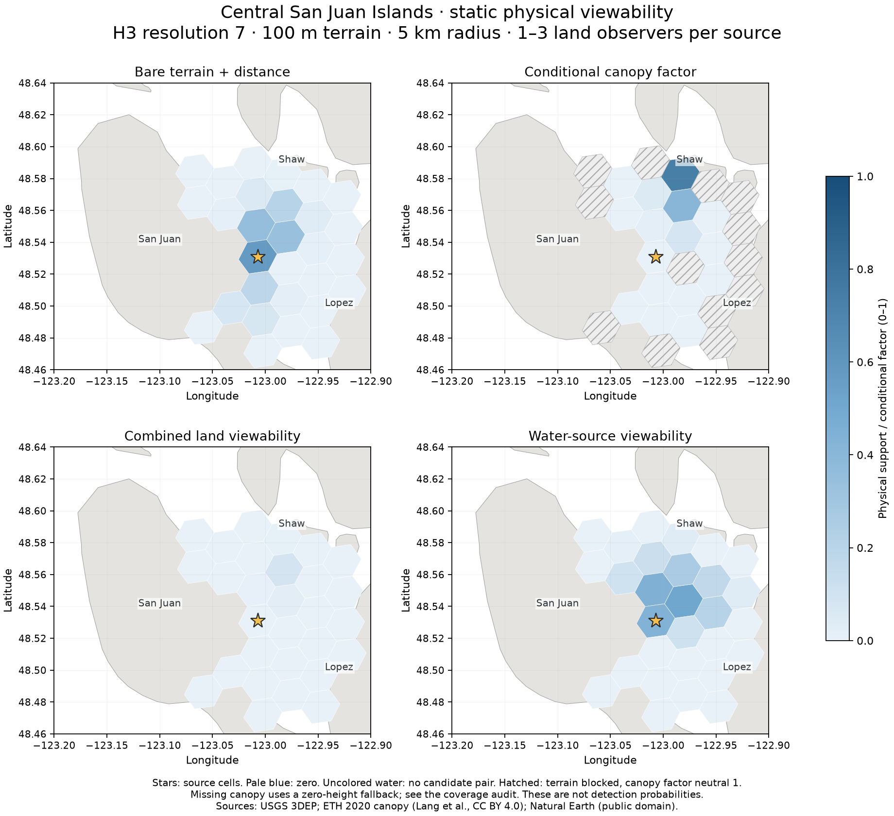

# San Juan Islands demo

This small, real-data example shows how terrain and canopy affect static physical viewability
around Friday Harbor, San Juan Island, Shaw Island and Lopez Island. It runs the toolkit's
production pipeline and retains the component factors for inspection.



Open the [interactive example](assets/san-juan-demo.html) after serving or downloading the HTML.
GitHub's file viewer shows its source; it does not execute the map. The map embeds its modeled
data but requires an internet connection for Leaflet/CDN libraries and OpenStreetMap tiles.
The [SVG figure](assets/san-juan-demo.svg) is available for documentation reuse, alongside the
[machine-readable run summary](assets/san-juan-demo-summary.json).

## Run it

From the repository root, in an environment with compatible GDAL/Rasterio and Python 3.11+:

```bash
python -m pip install -e '.[analysis,acquisition]'
PYTHONPATH=src python scripts/run_san_juan_demo.py
```

The [configuration](../configs/san_juan_demo.yaml) fixes the geography and scientific settings.
The [runner](../scripts/run_san_juan_demo.py) downloads Natural Earth land geometry and small
native-resolution windows from the ETH canopy COGs, then calls the toolkit's production
`download-dem`, `prepare-dem`, `download-chm` and `prepare-chm` stages. It executes the paired
production stages through `process(ViewshedRequest(...))`, including finalization and maps.
There is no synthetic-input fallback.

```bash
# Acquire/prepare inputs and record their coverage, without running LOS:
PYTHONPATH=src python scripts/run_san_juan_demo.py --prepare-only

# Redraw the documentation from existing validated final tables and maps:
PYTHONPATH=src python scripts/run_san_juan_demo.py --render-only

# Serve the documentation map locally:
python -m http.server 8000
# Open http://localhost:8000/docs/assets/san-juan-demo.html
```

All source rasters, intermediate tables, manifests and full map exports remain in the ignored
`data/san_juan_demo/` directory. The selected-stage call deliberately retains intermediates;
it does not invoke full-run cleanup. Only small, attributed documentation derivatives are kept
in `docs/assets/`. Running the demo refreshes those derivatives and their summary.

The checked example occupies about 48 MB locally. Its prepared grid has 321 × 342 pixels.
Runtime depends on hardware and provider availability; the summary's `elapsed_seconds` measures
that invocation and may include cache reuse. It is not a fresh-download benchmark.
`command_mode` distinguishes a pipeline build from a figure-only refresh.

## Settings and outputs

| Setting | Value |
|---|---|
| Source bbox, WGS84 | 123.20–122.90°W, 48.46–48.64°N |
| Source and target H3 | Resolution 7 |
| Analysis grid | 100 m, EPSG:32610 |
| LOS / candidate radius | 5 km; acquisition adds a 1 km AOI margin |
| Land viewpoints | 1–3 samples per source, scaled by active land fraction |
| Land observer / target height | 1.7 m / 1.0 m |
| Water observer / target height | 2.5 m / 1.5 m |
| Distance attenuation | Normalized logistic, 2.5 km midpoint, 0.8 km slope, 5 km cutoff |
| Canopy processing | ETH 2020 10 m inputs, maximum resampling to 100 m; 100 m observer clearance |

The 2026-10-03 run produced 2,468 land pairs from 84 sources and 2,956 water pairs from 92 sources.
Each source-role table has unique non-null `source_h3 × target_h3` keys. The four durable outputs
are under `data/san_juan_demo/outputs/`:

- `LAND_STATIC_WEIGHTS_R7.parquet`
- `WATER_STATIC_WEIGHTS_R7.parquet`
- `LAND_OBSERVATION_GEOMETRY_R7.parquet`
- `WATER_OBSERVATION_GEOMETRY_R7.parquet`

The production map exporter also writes selected-location, aggregate-land and aggregate-water
maps under `data/san_juan_demo/maps/h3r7/static/`. The runtime receipt lists relative artifact
paths, software versions, canopy source URLs/checksums, access times and input coverage.

## Read the figure

The first three panels use the same land source and candidate targets. The fourth uses the
nearest eligible water source; a mixed H3 cell can support both roles. Stars mark cell centroids,
not the individual sampled observers. The figure is cropped to the configured source bbox;
the tables retain candidate targets outside that bbox.

- **Bare terrain + distance:** distance is already integrated in the terrain kernel.
- **Conditional canopy factor:** additional obstruction, conditional on bare-terrain support.
  Hatched cells have zero bare-terrain support, so the neutral factor of 1 is not evidence of
  an unobstructed path.
- **Combined land viewability:** `weight_terrain × weight_vegetation`. Do not multiply by the
  separate centroid-distance diagnostic again.
- **Water-source viewability:** the configured opaque-land mask and water observer design.

Pale blue denotes computed zero; white/uncolored water has no candidate pair for that selected
source. The static figure uses a fixed 0–1 scale. The interactive export independently scales
factor layers for display, so its colors must not be used to compare factor magnitudes.

## Data coverage and interpretation limits

This is a coarse documentation example, not field-validated visibility or a recommended viewing
location. It does not estimate access, observer effort, reporting, animal presence or detection.
The 100 m grid, sparse observer sampling and generalized shoreline omit small coastal features.
The observer-clearance setting is an explicit modeling assumption, not a surveyed clearing.

The prepared DEM has no missing pixels in this run. Canopy is missing on **3,678 of 37,938 pixels
classified as land (9.7%)** across the buffered input grid, using Natural Earth's pixel-center
land mask. This may include shoreline disagreement; it is not an independent canopy accuracy
assessment. The demo explicitly uses `canopy_nodata_policy: zero`, which can overstate viewability
there. Missing pixels remain recorded as missing in the prepared raster and coverage audit;
their runtime fallback must not be described as observed zero-height vegetation. DEM nodata,
if present in a later acquisition, uses the configured opaque-barrier policy.

The coverage audit is in `data/san_juan_demo/outputs/components/analysis/input-coverage.json` and
is embedded in the documentation summary. Synthetic regression tests separately establish
implementation invariants; they do not qualify these real source datasets scientifically.

## Sources, attribution and reproduction

| Source | Acquisition and use | Rights |
|---|---|---|
| [USGS 3DEP](https://www.usgs.gov/3d-elevation-program/about-3dep-products-services) | Live service at 30 m; prepared on the 100 m analysis grid | Public domain |
| [Lang, Jetz, Schindler & Wegner: Global Canopy Height](https://langnico.github.io/globalcanopyheight/) | 2020 canopy, bounded windows from `N48W126` and `N48W123`; maximum resampling, then canopy LOS | [CC BY 4.0](https://creativecommons.org/licenses/by/4.0/) |
| [Natural Earth 1:10m land](https://www.naturalearthdata.com/downloads/10m-physical-vectors/10m-land/) | Land masks, complementary water geometry and figure background | [Public domain](https://www.naturalearthdata.com/about/terms-of-use/) |

Rights were reviewed for these small derived documentation figures/maps; raw source datasets
are not included in the repository. The derivatives retain canopy attribution and license links.
The interactive basemap retains its OpenStreetMap attribution. Processing changes the sources
through clipping, reprojection, aggregation and the toolkit's physical model.

The sources were accessed on 2026-10-03. USGS `version: live` and remote URLs are not immutable
releases. Preserve the ignored source bytes and manifests to reproduce this exact run; a later
live download may change the result. See [acquisition](data-acquisition.md),
[pipeline contracts](pipelines.md) and [scientific methodology](scientific-methodology.md).
