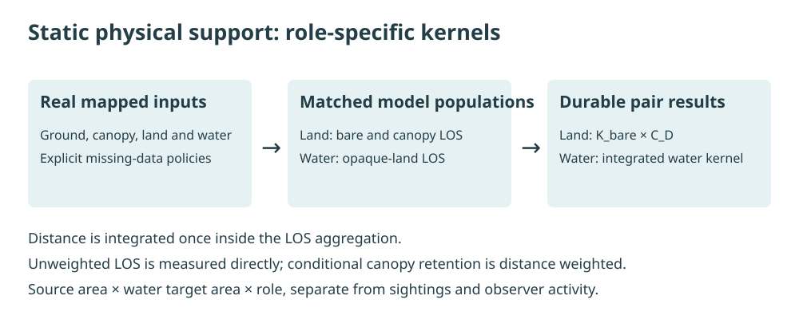

# Viewing concepts

The model asks a physical question: **how much modeled viewing support connects a source area
to a target water area under the recorded inputs and assumptions?**

## Areas, samples and pairs

A **source** is an H3 area from which viewing is modeled. It is not one exact lookout or evidence
that a person can access it. A **target** is a water area. Deterministic positions inside the
active source geometry represent the observer design; land and water use different target
populations. One explanatory path cannot establish the area average.

The durable pair key is `source_h3 × target_h3` within a source role. When combining roles,
retain `source_type` as well: one coastal H3 cell can participate as both land and water.

## Land and water answer different geometric questions

| Source role | Physical model | Canopy treatment |
| --- | --- | --- |
| Land | Matched bare-earth and ground-plus-canopy raster LOS toward target water | A conditional factor derived from the matched distance-integrated kernels |
| Water | Sampled viewing paths, opaque mapped land and a configured refracted horizon | Neutral factor with an explicit not-applicable state |

Distance attenuation is already evaluated inside the viewing kernel. The separate centroid-distance
diagnostic is useful for inspection and reuse; multiplying it into the static output again would
count distance twice.

## Read a result in context

An unweighted LOS diagnostic, a distance-integrated kernel and a final static weight describe
different quantities. None is a calibrated animal-detection probability. Missing inputs,
not-applicable factors, modeled zero and pairs outside the candidate universe also have different
meanings. Consult the recorded coverage and policy states before interpreting a value.

[Explore those distinctions on a real map](../examples.md) or continue to the
[product guide](../products/index.md).

## Trace the method

This illustration explains the workflow; it is not a measured view or ecological result.
The [method overview](../methodology.md) provides the staged explanation. The
[scientific contracts](../scientific-methodology.md) define the exact formulas, denominators,
clearance, horizon and missingness rules and remain the numerical source of truth.
